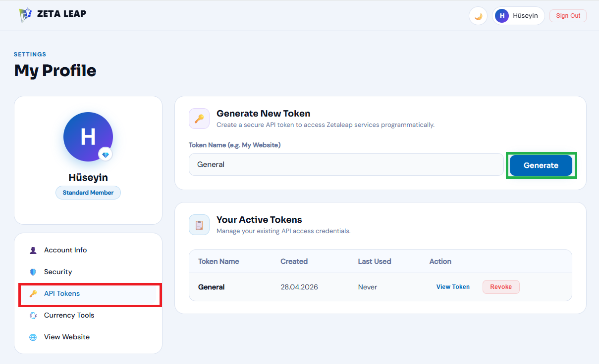
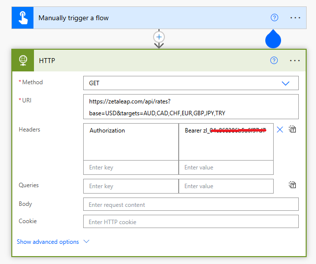

# 🚀 Free & Unlimited Power Automate Live Currency Integration (Zeta Leap API)

This repository provides a step-by-step guide on how to integrate real-time currency exchange rates into your Power Automate flows using the **Zeta Leap Global Currency Engine API**. Best of all? It offers **100% free and unlimited** access, making it the perfect solution for RPA developers handling automated invoicing, financial reporting, or international data entry without worrying about rate limits or hidden costs.

## 🌟 Key Features
* **Completely Free & Unlimited:** No daily rate limits, no subscription tiers, and no credit card required. Make as many API calls as your flows need.
* **Real-time Data:** Get the most up-to-date global exchange rates instantly.
* **Filtered Results:** Request only the specific target currencies you need, saving bandwidth and processing time.
* **Plug & Play:** Easy integration using the standard Power Automate `HTTP` action.

---

## 🛠️ Prerequisites

### 1. Generate Your Free API Token
To authenticate your unlimited requests, you just need a Bearer Token from your Zeta Leap profile.

1. Log in to [Zeta Leap](https://zetaleap.com).
2. Go to **My Profile** from the top right menu.
3. Select the **API Tokens** tab on the left sidebar.
4. Enter a name (e.g., `PowerAutomate_Prod`) and click **Generate**. 
5. **Copy the token** immediately and store it securely.




---

## ⚡ Power Automate Flow Configuration

The Zeta Leap API uses a simple `GET` request. Follow these settings to configure your **HTTP** action:

### HTTP Action Setup

* **Method:** `GET`
* **URI:** Define your `base` currency and `targets` (comma-separated).
    ```text
    [https://zetaleap.com/api/rates?base=USD&targets=AUD,CAD,CHF,EUR,GBP,JPY,TRY](https://zetaleap.com/api/rates?base=USD&targets=AUD,CAD,CHF,EUR,GBP,JPY,TRY)
    ```
* **Headers:** Add your API key under the `Authorization` header.
    * **Key:** `Authorization`
    * **Value:** `Bearer YOUR_API_TOKEN_HERE`




---

## 📊 API Response & Data Parsing

Upon a successful request (`200 OK`), the API returns a clean JSON structure:

```json
{
  "success": true,
  "base": "USD",
  "rates": {
    "AUD": 1.391481,
    "CAD": 1.362311,
    "CHF": 0.785011,
    "EUR": 0.85263,
    "GBP": 0.73839,
    "JPY": 159.3423,
    "TRY": 45.0422
  }
}
